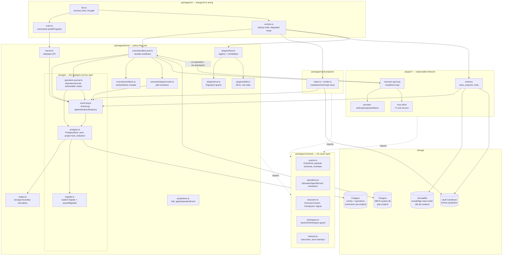
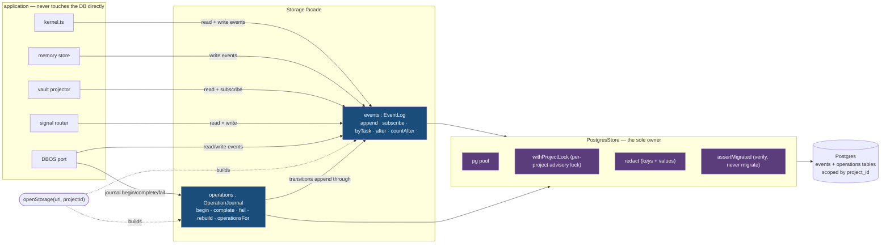
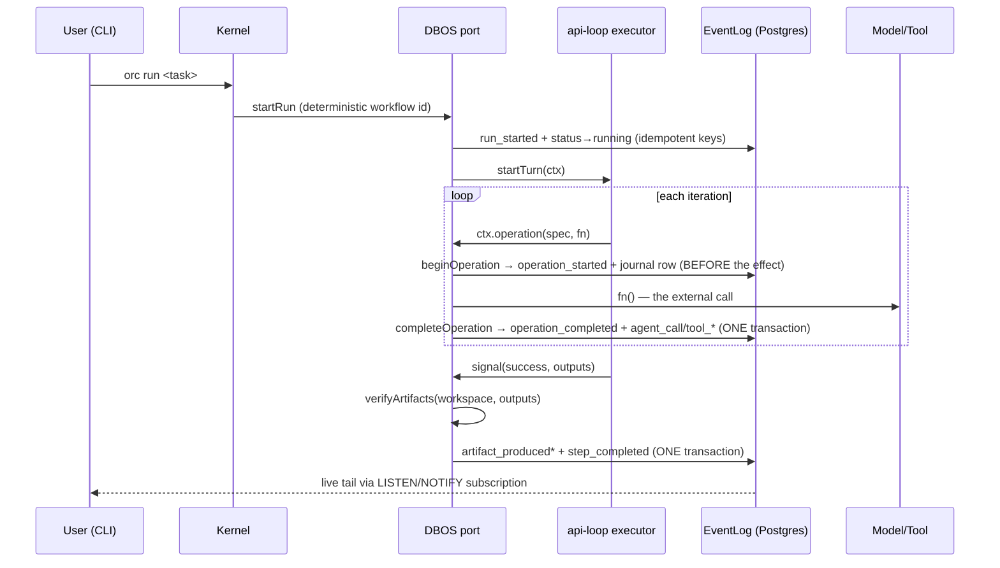

# Architecture

One paragraph of ground truth: the Postgres **event log is the only truth**. Every other
store — the operations journal, SurrealDB, the vault, DBOS's system database — is either a
rebuildable index over that log or a disposable projection of it. All state is `fold(events)`.
Everything below is arranged around protecting that invariant.

## System map

### Legend

| Notation | Meaning |
|---|---|
| Rectangle | First-party module (file named in the node) |
| Cylinder | Storage. **Postgres events is truth**; everything else is index or projection |
| Solid arrow | Runtime call / data flow direction |
| Dashed arrow | Compile-time dependency only (imports types/schemas, never calls back) |
| Subgraph box | One workspace package (or, nested, the storage service layer) |

**The storage service layer** (`packages/kernel/src/storage/`) is the single owner of every
Postgres access. `openStorage(url, { projectId })` returns a `Storage` facade with two
services — `events` (the `EventLog`: append / subscribe / query) and `operations` (the
`OperationJournal`: durable before/after nodes). Both sit on one `PostgresStore`, which owns
the connection pool, the per-project advisory lock, and secret redaction. No other module
opens a connection, takes the lock, or migrates. Consumers that only read/write events (the
kernel, memory store, vault projector) take the `EventLog`; the DBOS port, the one consumer
that needs both, takes the whole `Storage`. Migration is an explicit step (`migrateDatabase`
in test/CLI setup) — `openStorage` only *verifies* the schema and fails with guidance if the
database is behind, never mutating it as an open-time side effect.

Dependency rule (enforced by convention, `docs/EXTENDING.md` invariant 3): **contracts import
nothing**, kernel imports contracts, plugins import contracts (never the kernel's internals
beyond its public exports), and the kernel never imports plugins — it receives them
(`createDbosPort(opts)`, `createPluginHost(config, seed)`).

## The storage service — read/write boundary

Every Postgres read and write goes through one facade. Callers never touch a pool, a lock,
redaction, or migrations — they call `events` / `operations` and the service handles the rest.

Every write path is one locked transaction: `EventLog.append` acquires the project lock,
jsonb-shapes and redacts the payload, validates it, inserts, `pg_notify`s, and commits — all
atomically. `OperationJournal` writes its node and its transition events *through* that same
`EventLog` inside one lock, so the durable graph node and the append-only history can never
disagree. Reads are project-scoped queries that bypass the lock. Migration is separate
(`migrateDatabase`); `openStorage` only verifies and fails loudly if the schema is behind.

## Execution flow — one step, durably

A crash between `operation_started` and completion leaves an **unresolved node** — visible in
`orc status`, `orc replay`, and `vault/tasks/<id>/execution.md`. Recovery reuses completed
journal nodes and re-attempts unresolved ones as explicitly at-least-once (attempts counted).

## Responsibilities

| Component | Owns | Explicitly does NOT own |
|---|---|---|
| `contracts` | Zod schemas, event kinds + typed payloads, executor/port/store interfaces, the workspace containment guard | Any I/O, any storage, any policy |
| `kernel/storage/postgres` | The one Postgres owner: pool, project-scoped advisory lock (`withProjectLock`), redaction wiring, schema verification | Deciding *what* to store; the DBOS system database |
| `kernel/storage/event-log` | Project-bound append (jsonb-shape → redact → validate → insert → notify, one locked transaction), idempotency keys, lossless subscribe with reconnect, scoped queries + `countAfter` | Deciding *what* to append (callers do), projections |
| `kernel/storage/operation-journal` | Durable before/after nodes (begin/complete/fail), rebuild-from-log; transitions append through the `EventLog` in the same locked transaction | Model/tool specifics; the checkpoint machinery (that's the port) |
| `kernel/storage/migrate` | Explicit `migrateDatabase`; `assertMigrated` fails loudly when a database is behind | Migrating implicitly at open time |
| `kernel/redact` | The single storage-boundary normalizer: NUL strip + secret redaction (keys and values) | Being called anywhere except append/journal storage |
| `kernel/projections` | `fold(events) → State`, `applyOperationEvent` (shared by live journal and rebuild), crash dedup | Persisting anything |
| `kernel/kernel.ts` | Task/plan lifecycle API (create, propose, approve, cancel semantics) over the log | Execution |
| `kernel/dbos-port` | Durable run/step workflows, `ctx.checkpoint` and `ctx.operation` wrappers, retry policy, queue partitioning, cancellation cascade, output receipt commit | Model/tool specifics (executor's job), plan authoring |
| `kernel/signal-router` | Resolving splits when children reach terminal state; starting approved child runs | Composing plans, executing steps |
| `kernel/plugins/*` | Registry + propose-time ref validation (`host`), fingerprint trust store (`trust`), SKILL.md indexing (`skills`), T2 extension loading | Runtime tool execution (that's the hub/executor) |
| `plugins/executor-api-loop` | The model⇄tool loop, prompt assembly (incl. knowledge protocol), signal/output pre-flight, per-call operation journaling | Durability (delegates to ctx), trust, receipts |
| `plugins/memory` | Event-first note store (gateway stamps git revision), transactional Surreal projection, per-project database boundary, knowledge tools + degraded variants, `vault/memory/**` rebuild | Being authoritative — Surreal and vault/memory are disposable |
| `packages/vault-projector` | Deterministic markdown/mermaid renders of tasks, execution, lineage, task expansion; coalesced live re-render | Truth of any kind; whole-log scans |
| `packages/cli` | Command surface, startup order (projections before DBOS), degraded-memory wiring, project identity gate | Business rules (kernel's job) |

## Identity and isolation

`orc init` mints `projectId` into the committable `.orc/config.json`. Everything derives:

- events/operations rows carry `project_id`; every query filters on it
- the per-project advisory lock serializes writers within a project only
- DBOS system database name = `deriveSystemUrl(dbUrl, projectId)`
- SurrealDB database name = `projectDatabaseName(base, projectId)`
- `requireProject(config)` is the one gate: production paths take a `ProjectConfig`, and an
  uninitialized directory can only run `orc init`
