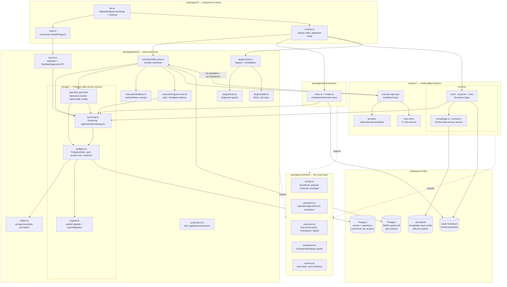
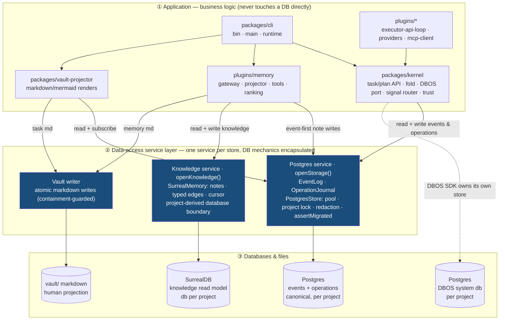
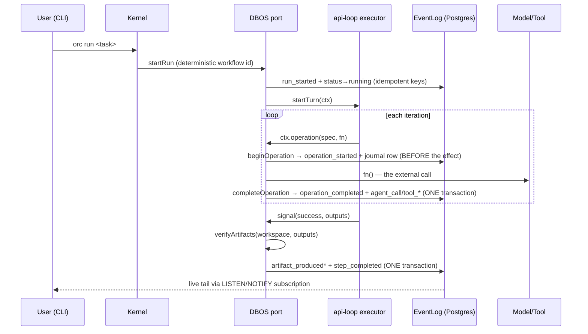

# Architecture

One paragraph of ground truth: the Postgres **event log is the only truth**. Every other
store — the operations journal, SurrealDB, the vault, DBOS's system database — is either a
rebuildable index over that log or a disposable projection of it. All state is `fold(events)`.
Everything below is arranged around protecting that invariant.

## System map — modules

Every first-party module, its package, and how the calls flow. The data-access services live
in the nested `storage/` cluster (Postgres) and the memory plugin's `knowledge.ts` (Surreal);
the tier-by-tier view is the next section.

### Legend

| Notation | Meaning |
|---|---|
| Rectangle | First-party module (file named in the node) |
| Nested box | The data-access service inside its package (`storage/`, memory's `knowledge.ts`) |
| Cylinder | A database or file store. **Postgres events is truth**; the rest are index or projection |
| Solid arrow | Runtime call / data flow direction |
| Dashed arrow | Compile-time dependency only (imports types/schemas, never calls back) |

## System map — three tiers

The same system as three layers: business logic never touches a database — every read and
write crosses the **data-access service layer** in the middle. One service per store, each
encapsulating connection, project scoping, locking/transactions, and redaction. Swap a
backend or add a store and only its service changes; the tiers above and below do not.

### Legend

| Notation | Meaning |
|---|---|
| **① / ② / ③** | The three tiers: application → data-access services → databases |
| Blue box (tier ②) | A data-access service — the only code that opens/queries its store |
| Cylinder (tier ③) | A database or file store. **Postgres events is truth**; the rest are index or projection |
| Solid arrow | Runtime call / data flow (every app→DB edge passes through a service) |
| Dashed arrow | DBOS SDK manages its own system database — the one store not behind our services |

The layer is realized as sibling openers, each returning a facade whose methods are the whole
contract — callers never see a pool, a lock, or a query:

- **`openStorage(url, { projectId })` → `Storage { events, operations }`** — the Postgres
  service (`packages/kernel/src/storage/`). `PostgresStore` owns the pool, the per-project
  advisory lock, redaction, and schema verification; `EventLog` (append/subscribe/query) and
  `OperationJournal` (before/after nodes) sit on top. Migration is a separate explicit
  `orc db migrate` step — `openStorage` only verifies and fails loudly if the schema is behind.
- **`openKnowledge(config)` → `Knowledge`** — the SurrealDB service
  (`plugins/memory/src/knowledge.ts`), encapsulating auth and the project-derived database
  name. The memory gateway/projector/tools read and write through it and never open a Surreal
  session themselves.

The kernel is business logic and stays free of both: it takes an `EventLog`, not a pool. The
memory plugin's `createMemory` is the orchestrator that assembles the two services into the
memory domain services. The one exception drawn dashed: the DBOS SDK manages its own system
database directly (durable workflow checkpoints), which is not ours to mediate.

Dependency rule (`docs/EXTENDING.md` invariant 3): **contracts import nothing**, kernel
imports contracts, plugins import contracts (never the kernel's internals beyond its public
exports), and the kernel never imports plugins — it receives them (`createDbosPort(opts)`,
`createPluginHost(config, seed)`).

## The storage service — read/write boundary

Every Postgres read and write goes through one facade. Callers never touch a pool, a lock,
redaction, or migrations — they call `events` / `operations` and the service handles the rest.

Every write path is one locked transaction: `EventLog.append` acquires the project lock,
jsonb-shapes and redacts the payload, validates it, inserts, `pg_notify`s, and commits — all
atomically. `OperationJournal` writes its node and its transition events *through* that same
`EventLog` inside one lock, so the durable graph node and the append-only history can never
disagree. Reads are project-scoped queries that bypass the lock. Migration is separate
(`orc db migrate` → `migrateDatabase`); `openStorage` only verifies and fails loudly if the
schema is behind. Missing migration tables map to 0 applied; connection/auth/permission errors
remain their original failures.

## Execution flow — one step, durably

A crash between `operation_started` and completion leaves an **unresolved node** — visible in
`orc status`, `orc replay`, and `vault/tasks/<id>/execution.md`. Recovery reuses completed
journal nodes and re-attempts unresolved ones as explicitly at-least-once (attempts counted).

## Feedback delivery and grounded approval

`feedback_provided` is both audit history and the durable outbox. The event carries the requesting
step/run envelope; immediate delivery and the signal router use `feedback:<event-seq>` as DBOS's
idempotency key. The live router handles new events, and startup replays replies for still-running
tasks, healing a crash after append but before send.

For a grounded plan step, an exact normalized `approve` reply also stores SHA-256 of the canonical
plan-note graph. `finalize_plan` recomputes that hash and accepts only a human approval from the same
run token. Missing, cross-attempt, or stale approval returns a tool error before any child split.

## Responsibilities

| Component | Owns | Explicitly does NOT own |
|---|---|---|
| `contracts` | Zod schemas, event kinds + typed payloads, executor/port/store interfaces, the workspace containment guard | Any I/O, any storage, any policy |
| `kernel/storage/postgres` | The one Postgres owner: pool, project-scoped advisory lock (`withProjectLock`), redaction wiring, schema verification | Deciding *what* to store; the DBOS system database |
| `kernel/storage/event-log` | Project-bound append (jsonb-shape → redact → validate → insert → notify, one locked transaction), idempotency keys, lossless subscribe with reconnect, scoped queries + `countAfter` | Deciding *what* to append (callers do), projections |
| `kernel/storage/operation-journal` | Durable before/after nodes (begin/complete/fail), rebuild-from-log; transitions append through the `EventLog` in the same locked transaction | Model/tool specifics; the checkpoint machinery (that's the port) |
| `kernel/storage/migrate` | Explicit `migrateDatabase`; `assertMigrated` fails loudly when a database is behind | Migrating implicitly at open time |
| `kernel/redact` | The single storage-boundary normalizer: NUL strip + secret redaction (keys and values) | Being called anywhere except append/journal storage |
| `kernel/projections` | `fold(events) → State`, `applyOperationEvent` (shared by live journal and rebuild), crash dedup | Persisting anything |
| `kernel/kernel.ts` | Atomic task/plan lifecycle, feedback outbox events, plan-hash-bound human approval over the log | Execution |
| `kernel/dbos-port` | Durable run/step workflows, `ctx.checkpoint` and `ctx.operation` wrappers, retry policy, queue partitioning, cancellation cascade, output receipt commit | Model/tool specifics (executor's job), plan authoring |
| `kernel/signal-router` | Resolving splits, starting approved children, and live/startup delivery of committed feedback | Composing plans, executing steps |
| `kernel/plugins/*` | Registry + propose-time ref validation (`host`), fingerprint trust store (`trust`), SKILL.md indexing (`skills`), T2 extension loading | Runtime tool execution (that's the hub/executor) |
| `plugins/executor-api-loop` | The model⇄tool loop, prompt assembly (incl. knowledge protocol), signal/output pre-flight, per-call operation journaling | Durability (delegates to ctx), trust, receipts |
| `plugins/memory` | Event-first note store (gateway stamps git revision), transactional Surreal projection, per-project database boundary, knowledge tools + degraded variants, `vault/memory/**` rebuild | Being authoritative — Surreal and vault/memory are disposable |
| `packages/vault-projector` | Deterministic markdown/mermaid renders of tasks, execution, lineage, task expansion; coalesced live re-render | Truth of any kind; whole-log scans |
| `packages/cli` | Pre-bootstrap help/init/migrate, command surface, project discovery, startup/shutdown order, degraded-memory wiring | Business rules (kernel's job) |

## Identity and isolation

`orc init` mints `projectId` into the committable `.orc/config.json`. Everything derives:

- events/operations rows carry `project_id`; every query filters on it
- the per-project advisory lock serializes writers within a project only
- DBOS system database name = `deriveSystemUrl(dbUrl, projectId)`
- SurrealDB database name = `projectDatabaseName(base, projectId)`
- `requireProject(config)` gates project commands; uninitialized directories can still run
  help, `orc db migrate`, and `orc init`
- `orc init` seeds the first-party analysis/plan/documentation skills without overwriting project files
