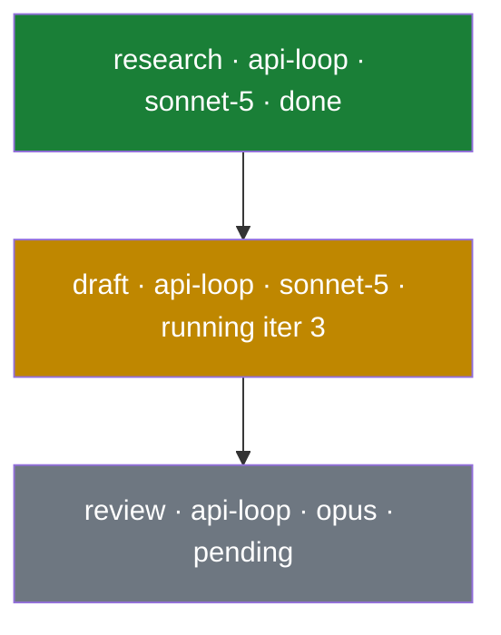

# M4a — Event Stream + Vault Projector Design Specification

**Date:** 2026-07-17
**Status:** Approved design, pre-implementation
**Amends:** `2026-07-16-orchestrator-design.md` (§8.2 Vault, R10, ADR-006)
**Milestone:** M4a. M4b (knowledge graph / memory) and M5 (recursion/strategies) follow.

---

## 1. Goal

Two things, layered:

1. **A push-based event stream** over the append-only log — the single, ordered,
   replayable datastream every live consumer subscribes to (CLI tail today; vault, web
   GUI, memory tomorrow). Built correctly now so later consumers are additive, not a
   rewrite.
2. **An OKF-compatible markdown vault** projected from that stream — Obsidian-ready,
   showing the task/plan/log/sessions graph and a live "current working graph" as a run
   proceeds. One bidirectional surface: the plan file, editable during
   `awaiting_approval`, parsed back into `plan_edited`.

Truth stays in the event log; the vault is a disposable, re-renderable projection.

## 2. Scope

**In:** an `EventLog.subscribe` API backed by Postgres `LISTEN/NOTIFY` (seq-cursored,
ordered, catch-up on connect); migration of the existing CLI tail off polling onto it; a
`plugins/vault-projector/` package (renderer + single writer + plan round-trip); live
projection driven by the stream + on-demand `orc vault render [taskId]`; plan pull via
`orc edit <taskId> --from-vault`; projection-only hand-edit detection; a `vaultDir`
config setting.

**Out:** the knowledge-graph / memory system, `VaultGateway`, `memory_written` (M4b); a
web GUI (the stream foundation makes it additive later, but it is not built here);
Obsidian Canvas; any new *domain* event kind; kernel workflow changes.

## 3. Requirements captured

- **RQ1** OKF markdown projection, Obsidian-ready, watch a task grow (R10).
- **RQ2** Two systems — *History* (append-only, immutable, reproducible, replay) and the
  *knowledge graph* (mutable, navigable, delete-on-demand). M4a builds History and its
  projection; the knowledge graph is M4b (§12).
- **RQ3** Live view of running agents and what they create (current working graph).
- **RQ4** A clean, atomic datastream with small composable functions so consumers update
  efficiently — the foundation for an efficient, fail-proof, small-team-capable app and a
  later web GUI, **without tech debt**.
- **RQ5** Bidirectional plan editing during `awaiting_approval`.
- **RQ6** Living documentation generated on demand from the knowledge graph (M4b+, §12).

## 4. Architecture

Two layers, both first-party, wired by the runtime.

### 4.1 Event stream (kernel)

`EventLog` gains a durable, ordered subscription — the one datastream (RQ4):

```
subscribe(opts: { fromSeq?: number }, handler: (e: EventRecord) => void): () => void
```

Mechanism (standard Postgres, no new dependency, not complicated):

- **Append side:** each committed append issues `NOTIFY orc_events, '<seq>'`. Issued
  inside the same transaction, so Postgres delivers it **only on commit** — rolled-back
  appends never notify (this is why the stream is *more* correct than the in-process
  `onAppend` hook, not merely faster).
- **Listen side:** one dedicated connection (outside the query pool — `LISTEN` holds its
  connection) runs `LISTEN orc_events`. On notify, the stream reads
  `events WHERE seq > cursor ORDER BY seq` and hands each record to subscribers in order,
  advancing the cursor. On subscribe it first drains `fromSeq..now` so a consumer that
  connected late never misses events (catch-up = replay; RQ2 reproducibility).
- **Delivery contract:** ordered by `seq`, at-least-once (a reconnect may re-deliver the
  tail); consumers are idempotent by `seq` — trivial, since each event already carries a
  unique monotonic `seq`.

The in-process `event_appended` hook stays for T2 extensions (observe-only, best-effort,
in-process). The durable/ordered/cross-process **stream** is `subscribe`. Distinct
purposes, no redundancy.

### 4.2 Vault projector (plugin)

A `plugins/vault-projector/` package — a pure renderer + a single writer + the plan
round-trip. Wired by the runtime like `mcp-client` (it needs `EventLog` and
`config.vaultDir`, which the T2 `ExtensionApi` does not expose). Kernel and contracts are
untouched apart from §4.1's `subscribe` and one config field.

```
plugins/vault-projector/src/
├── render.ts     # pure: (EventRecord[]) → VaultFiles           (no fs, no clock)
├── plan-md.ts    # renderPlanFile(plan) ⇄ parsePlanFile(text)   (Bun.YAML + zod)
├── write.ts      # single writer: atomic per-file, skip-unchanged, drift warn
└── index.ts      # createVaultProjector({ log, config }) → { start, renderTask,
                  #                          renderAll, parsePlanFile, close }
```

### Design decisions

- **D1 — Renderer input is `EventRecord[]`, not `State`.** The renderer folds events for
  summaries (task/plan/log) and walks raw events for step transcripts.
  `agent_call`/`tool_call`/`tool_result`/`signal_received` are "traceability only" in
  `fold` and deliberately not retained in `State`; deriving the transcript straight from
  events keeps `State` lean. Renderer functions are pure — no fs, no clock — so they are
  unit-testable and replay-identical.

- **D2 — The stream delivers committed events in `seq` order; consumers read by cursor.**
  `NOTIFY`-on-commit means no rolled-back event ever reaches a consumer. A subscriber
  catches up from its `fromSeq` on connect, so nothing is missed across a restart. The
  projector keys its work by `seq`, so at-least-once redelivery is idempotent.

- **D3 — One real seam, no speculative interfaces.** The event stream (§4.1) is a genuine
  shared foundation (CLI tail, projector, future web GUI, memory) — building it is correct,
  not speculative. Beyond it, consumers are plain functions; there is no `Projection`
  interface with a single implementation.

- **D4 — `vaultDir` is the vault root; `skillsDir` derives from it.** Config gains
  `vaultDir` (default `<dir>/vault`). `skillsDir`, when not set explicitly, resolves to
  `<resolved vaultDir>/skills`, so overriding `vaultDir` moves skills with it (M3's
  independent default did not). Default is identical to M3's, so nothing breaks. Because
  the default depends on another resolved field it is derived once from the parsed
  `vaultDir` in `loadConfig` — a documented cross-field derivation, not a scattered `??`
  default (the house rule bans the latter, not the former).

- **D5 — Two graphs, one vault; the projector owns only the trace graph.** The vault holds
  distinct graphs with different write disciplines, and separating them is deliberate:
  - **Trace graph** — `vault/tasks/**` + root `index.md`. A projection of the event log:
    derived, disposable, re-renderable, keyed by task/step id. Owned *exclusively* by this
    projector (R9 — "how the run was done").
  - **Knowledge graph** — `vault/memory/**`. Mutable, cross-task, agent/user-authored;
    owned by M4b (R6 — "what we know"). Not created or touched by M4a.
  - (`vault/skills/**` is M3's, owned by the `SkillIndex`.)

  The projector writes and deletes **only** trace-graph files; it never touches
  `vault/memory/` or `vault/skills/`. `orc vault render` rebuilds the trace subtree **in
  place, per file** — never a whole-vault wipe, so memory and skills are never at risk.
  The ownership principle (each owner writes only its subtree) generalizes to M4b with no
  change here.

- **D6 — Current working graph = the trace graph at its live edge, as a status DAG (RQ3).**
  No new data is needed: `step_started` (which step/agent is live), `agent_call` (each
  iteration), `tool_call`/`tool_result` (every file written, e.g. `fs_write`), `signal`
  are all in the log. The task `index.md` renders the plan as a **mermaid DAG** (Obsidian
  renders `mermaid` natively — no plugin, no dependency) with nodes styled by live status
  and annotated `executor·model·iter N`; the root `index.md` gets an **active-runs**
  section. A running three-step plan renders like this (illustrative):



  Driven by the §4.1 stream, the DAG and the per-step `sessions/<step>.md` update within
  the flush window of each event — a genuine live view in Obsidian. A real-time *web*
  dashboard is out of v1 scope, but it consumes the **same** `subscribe` stream when
  built (RQ4) — no reshaping.

- **D7 — The event log *is* the stream; no external broker.** A message broker (RabbitMQ,
  etc.) was assessed and declined. The append-only Postgres log is already durable,
  ordered, and replayable — the property the whole design rests on (R9). A broker would
  duplicate it (two sources of truth, reconciliation, ordering divergence) or, used as the
  log (Kafka/Redis Streams), impose operational weight that fights local-first
  (§2/ADR-002). RabbitMQ is a queue, not a log — it cannot replay, so it would not even
  remove the Postgres log. Fail-proofing comes from DBOS + Postgres, not a transport. A
  broker earns its place only at many-producer / high-throughput / multi-tenant scale;
  §4.1's `subscribe` is the local-first-correct realization, and the seam keeps adding one
  later additive.

## 5. Data flow (push, no polling)

- **Live:** `createVaultProjector(...).start()` calls `log.subscribe({ fromSeq })`. Each
  delivered event is coalesced per task into a short flush window, then `renderTask`
  writes only changed files. Coalescing means one fold per burst, not per event — the
  system's own "state = fold(log)" pattern, bounded; incremental fold is a *measured*
  future optimization, deliberately not built now (not-overly-complicated guardrail).
- **On-demand:** `orc vault render [taskId]` (all if omitted) → fold → render → write. The
  disposable-rebuild path: the trace subtree is re-writable from the log at any time, in
  place per file (never a whole-vault wipe; memory/skills untouched — D5).
- **CLI tail migrated:** `orc run`'s event tail switches from its 500 ms poll to
  `log.subscribe`, proving the seam with a third consumer and deleting existing polling.
- **Shutdown:** `close()` unsubscribes, closes the listener connection, and flushes any
  pending render before `process.exit` (awaited in `bin.ts` next to `hub.close()` /
  `host.shutdown()`), so the final render is never dropped.
- **Containment:** subscriber handlers are wrapped so a projector error warns and never
  breaks the stream or a run.

## 6. File shapes (OKF: `type` frontmatter + markdown-link graph)

| Path | `type` | Contents |
|---|---|---|
| `vault/index.md` | `index` | all tasks with status + links; active-runs section (D6) |
| `tasks/<id>/index.md` | `task` | status, spec, budget; live status DAG (mermaid, D6); links to latest plan / log / sessions / child tasks |
| `tasks/<id>/plan-v<N>.md` | `plan` | plan in YAML frontmatter (§7); lean human summary body |
| `tasks/<id>/log.md` | `log` | newest-first event trail (`seq · ts · kind · stepId? · summary`) |
| `tasks/<id>/sessions/<step>.md` | `session` | R9 transcript: per-iteration agent text, tool calls/results, signal |

Path safety: task ids are UUIDs, step ids match `^[\w-]+$` (enforced in `PlanStep`) — no
traversal. Every path is under the trace subtree; the writer's ownership is confined to it
(D5), so `memory/` and `skills/` are structurally out of reach.

## 7. Plan round-trip (the bidirectional surface, RQ5)

**Authoritative representation: the plan in YAML frontmatter** — one `Bun.YAML.parse`
(native to Bun 1.3, zero dependency) round-trips it losslessly; zod validates. The body is
a **lean human summary** (title, step count, a compact status list) plus a one-line note —
*the frontmatter above is authoritative; edit it, then run `orc edit <taskId>
--from-vault`*. No full duplicate of the steps in the body: no duplication, no stale-body
smell.

- `renderPlanFile(plan)` → `---\n<yaml {type, task, version, status, strategyRef,
  costEstimateUSD, steps}>\n---\n<summary + edit note>`.
- `parsePlanFile(text)` → extract frontmatter → `Bun.YAML.parse` → pick `{strategyRef,
  costEstimateUSD, steps}` → **`PlanDraft.parse`** (zod is the single authority;
  `type`/`task`/`version` are display-only, ignored on parse — `editPlan` assigns the real
  next version).

**Write-once per version.** A plan version is immutable in the log, so its file is written
once and never rewritten — which protects an in-progress human edit with zero drift
machinery: pulling an edit mints the *next* version (a new file), so the edited file and a
fresh render never collide.

**Pull:** `orc edit <taskId> --from-vault` reads the latest `plan-v<N>.md`, `parsePlanFile`
→ `kernel.editPlan` → `plan_edited` (v+1). Reuses the existing `edit` command rather than a
new verb.

## 8. Hand-edit detection (projection-only files)

`log.md` / `session.md` / index files are projection-only. A small
`vault/.orc-manifest.json` (relPath → sha256 of last projected content) lets the writer
warn **only on true drift** (on-disk ≠ last-projected *and* ≠ new render), then overwrite
(disposable). Without it, every legitimate log growth would look like an edit. The manifest
is a dotfile, outside the Obsidian graph. The writer is otherwise atomic per file (`write
tmp → rename`, so Obsidian never reads a half-file), creates parent dirs, and skips files
whose content is unchanged (idempotent re-render = zero writes).

## 9. Config & CLI

- Config: `vaultDir` (default `<dir>/vault`); `skillsDir` derived (D4).
- CLI: `orc vault render [taskId]`; `orc edit <taskId> --from-vault`; `orc run` tail now
  stream-driven.
- No new domain event kinds, no kernel workflow changes; the only kernel addition is
  `EventLog.subscribe` (§4.1).

## 10. Testing

- **Stream (§4.1):** `subscribe({fromSeq:0})` on a populated log delivers all events in
  `seq` order; an append after subscribe is delivered via `NOTIFY` (no poll); a
  transaction that rolls back delivers nothing (commit-only); a late subscriber with a
  cursor catches up without gaps; `close()` releases the listener connection.
- **Round-trip property (critical):** `parsePlanFile(renderPlanFile(plan))` deep-equals the
  original `PlanDraft` — including arrays (`dependsOn`, `skillRefs`, `toolRefs`) and
  `costEstimateUSD: null`.
- **Renderer:** golden key-fields per file type; session transcript walks agent/tool/signal
  in order; task index emits a valid `mermaid` DAG (one node/step, edges match `dependsOn`,
  nodes styled by status); root active-runs lists only `running` tasks; render is a pure
  fold — folding twice yields identical files (replay).
- **Writer:** idempotent (re-render unchanged → no writes); write-once plan protection;
  projection-only drift → warn + overwrite; atomic write leaves no tmp files; never writes
  outside the trace subtree.
- **Pull:** edit the plan YAML → `orc edit --from-vault` → new version with edited values;
  malformed YAML / schema violation → clear error, no event appended.
- **Integration:** a full fake-provider run, tail and vault both stream-driven, yields a
  complete `task/plan/log/sessions` tree with valid frontmatter and a live-updating DAG.

## 11. Implementation order (for the plan)

1. `EventLog.subscribe` + `NOTIFY` on append (§4.1) with its tests.
2. Migrate the CLI tail onto `subscribe` (delete the poll) — proves the seam.
3. `vaultDir` config + `skillsDir` derivation (D4).
4. Pure renderer `render.ts` + `plan-md.ts` round-trip (the correctness core).
5. `write.ts` (atomic, skip-unchanged, drift) + `createVaultProjector`.
6. Wire the projector to `subscribe`; `orc vault render` + `orc edit --from-vault`.
7. Integration test: full run, stream-driven tail + vault.

## 12. What this unlocks (context, not scope)

The vault is two graphs in one OKF bundle (D5), and the stream (§4.1) is the shared
foundation.

- **M4a (this spec):** the event stream + the trace graph.
- **M4b (knowledge graph / memory):** `vault/memory/**` — the *current-state, evolving*
  view living documentation is generated from: architecture, decisions and reasons, present
  file structure, latest edits. **Derived facts** (file structure, recent edits) fold from
  the trace — never stored twice; **authored knowledge** (architecture, decisions, reasons)
  is written by agents/users. History vs knowledge mutability is not a contradiction:
  history is append-only/immutable; the knowledge graph is mutable *current state* whose
  every create/update/**delete** is itself an append (`memory_written` / `memory_deleted`
  tombstones), and the graph is the fold of those events — it evolves and stays bounded
  while history still replays to any point. (Open M4b nuance: "current file structure" may
  need a filesystem scan, not only folded `fs_write` events, if agents edit outside orc's
  tools.)
- **M5 (strategies):** topologies that route steps to reuse the knowledge graph.
- **Living documentation:** generated on demand from the knowledge graph — a view, not a
  stored graph.
- **Web GUI / small-team (RQ4):** an SSE/WebSocket endpoint tails `subscribe` by `seq` and
  patches single nodes/edges in the browser. Additive on the foundation built here — the
  no-debt guarantee you asked for.

The three lenses map cleanly: **history** + **current working graph** are the trace graph
(M4a); **what's created / living docs** is generated from the M4b knowledge graph.
